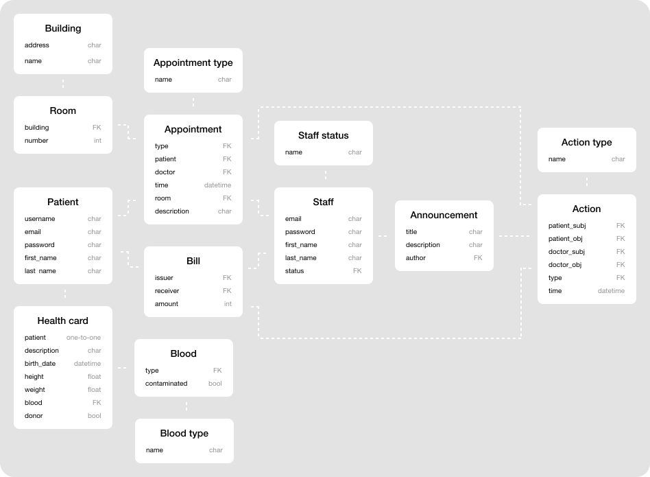

# Comprehensive description of object domain, associated database, and app functionality

---

## Functionality

All users can be divided into two main categories: 
1. Guests
2. Authenticated users

**Guests** are only able to look through the general data, e.g. list of doctors or app calendar. To authenticate, a guest
can either sign up, if they do not have an account, or log in the system otherwise.
Authenticated user can either be a **patient**, a **doctor (staff member)**, or an **admin (staff member)**. 

#### Patient can
1. Manage their appointments
2. Manage their health data via a health card
3. Manage available dates for an appointment
4. Make an appointment with their doctor
5. Receive and pay bills

#### Staff member (doctor) can
1. Manage their patients
2. Manage their appointments
3. Manage patient's health data via their health cards
4. Send bills to patients
5. Make announcements

#### Admin can
1. Manage (delete, update info, etc.) staff members
2. Carry out doctor's responsibilities
3. View the logs journal
4. Alter the logs

---

## Database

### Diagram

### Description

#### Appointment type
Describes the type of single appointment with a doctor. Contains the following fields:
1. `name (char)` – Can either be Primary care, Adult specialty care, or Pediatric specialty care.
Besides that, appointment type can be a blood test, donor eligibility evaluation, etc. (*max. 100 characters*).

#### Appointment
Describes an appointment. Contains the following fields:
1. `id (int)` – Unique identifier of the appointment.
2. `type (Foreign Key)` – Type of the appointment.
3. `patient (Foreign Key)` – Patient that scheduled the appointment.
4. `doctor (Foreign Key)` – Doctor with whom the appointment was scheduled.
5. `time (datetime)` – Date & time of the appointment (*Jan. 1st 1900 – Current date*).
6. `room (Foreign Key)` – Room.
7. `description (char)` – Brief description that doctor can write (*max. 1000 characters*). 

#### Announcement
Describes an announcement that a doctor can make (e.g. reschedule of some appointments). Contains the following fields:
1. `id (int)` – Unique identifier of the announcement.
2. `title (char)` – Title of the announcement (*max. 256 characters*).
3. `description (char)` – Announcement's info (*max. 1000 characters.*).
4. `author (Foreign Key)` – Announcement's author (doctor).

#### Bill
Describes the bill sent to patient by a doctor. Contains the following fields:
1. `id (int)` – Unique identifier of the bill.
2. `issuer (Foreign Key)` – Issuer of the bill (either doctor or admin, more generally – staff).
3. `receiver (Foreign Key)` – Receiver of the bill (patient).
4. `amount (int)` – Equivalent to price of the provided service (*max. 99999*).

#### Staff status
Describes all possible user statuses. Contains the following fields:
1. `name (char)` – Can either be Doctor, or Admin (*max. 7 characters*).

#### Patient
Describes general user entity. Contains the following fields:
1. `username (char)` – User's unique and custom pseudonym (*max. 64 characters*).
2. `email (char)` – Email (*max. 64 characters*).
3. `password (char)` – Set by user when first logging into the system (*max. 64 characters*).
4. `first_name (char)` – User's first name (*max. 64 characters*).
5. `last_name (char)` – Either last name or surname (*max. 64 characters*).

#### Staff
Describes general user entity. Contains the following fields:
1. `id (int)` – Unique identifier of staff member.
2. `email (char)` – Email (*max. 64 characters*).
3. `password (char)` – Set by user when first logging into the system (*max. 64 characters*).
4. `first_name (char)` – User's first name (*max. 64 characters*).
5. `last_name (char)` – Either last name or surname (*max. 64 characters*).
6. `status (Foreign Key)` – Staff member's status.

#### Health card
Describes all the medical data of a single patient thus creating a **One-to-One** relation
to Patient.
Contains the following fields:
1. `patient (One-to-One)` – Patient to whom the card belongs. One card can only be assigned to one patient. 
2. `description (char)` – Card's brief description. Content is determined by a doctor (*max. 1000 characters*).
3. `birth_date (datetime)` – Patient's date of birth (*Jan. 1st, 1900 - Current date*).
4. `height (float)` – Patient's height (*max. 3 m*).
5. `weight (float)` – Patient's weight (*max. 1000 kg*).
6. `blood (Foreign Key)` – Patient's blood info. Refers to `Blood` entity.
7. `donot (bool)` – True if patient is a donor, false otherwise.

#### Blood 
Presents information about patient's blood. Contains the following fields:
1. `type (Foreign Key)` – Blood type.
2. `contaminated (bool)` – Whether blood is contaminated.

#### Blood type
Describes blood type. Contains the following fields:
1. `name (char)` – Name of the blood type. Can either be A+, A-, B+, B-, AB+, AB-, O+, O- (*max. 3 characters*).

#### Building
Presents information about a single building of the bank. Contains the following fields:
1. `address (char)` – Full & unique address of the building (*max. 64 characters*).
2. `name (char)` – If present – name of the building (*max. 64 characters*).

#### Room
Presents information about a room in the building of the bank. Contains the following fields:
1. `building (Foreign Key)` – A building in which the room is located.
2. `number (int)` – Number of the room (*max. 999*).

#### Action type
Describes action type. Contains the following fields:
1. `name (char)` – Name of the action type (*max. 64 characters*).

#### Action 
Describes a single action in the log journal. Contains the following fields:
1. `id (int)` – Unique identifier of the action.
2. `object (Foreign Key)` – User (creates the action). 
3. `subject (Foreign Key)` – User (towards whom the action is directed). 
4. `type (Foreign Key)` – Type of the action. Refers to `Action type` entity.
5. `time (datetime)` – Date & time when action was carried out (*Jan. 1st 1900 – Current date*).
